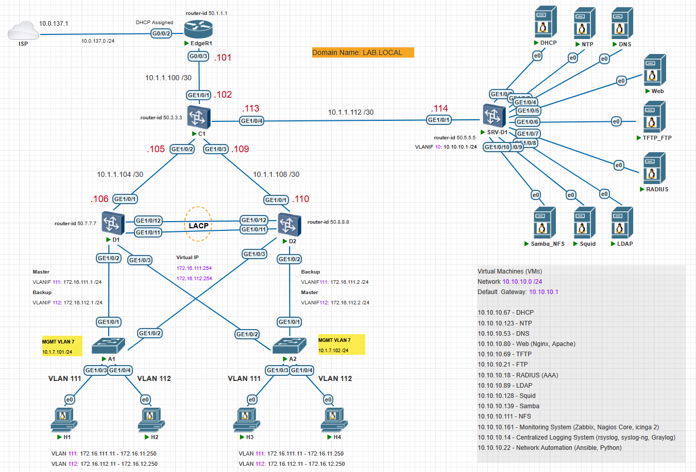

# Huawei-Based Enterprise Network Design and Implementation

### Тақырыбы: Huawei құрылғылары негізінде корпоративті желіні жобалау және конфигурациялау
### Жұмыстың орындалу қадамы: 
  1) VLAN;
  2) Link Aggregation. LACP;
  3) MSTP (Multiple Spanning Tree Protocol);
  4) Switched Virtual Interface (SVI);
  5) VRRP (Virtual Router Redundancy Protocol);
  6) IP Address Configuration;
  7) Single area OSPFv2;
  8) Access Control List (ACL);
  9) Network Address Translation (NAT);
  10) Default Static Routing.

> SVI — L3 интерфейс, яғни VLAN-ның виртуалды routed интерфейсі (virtual routed interface)

### Корпоративті желінің топологиясы

[Download Link for PNETLab Topology File](Topology/Topology_EnterpriseNetworkDesign_HQ1_v1_Huawei.zip)

### A1, A2 – Access Layer Switch-ті конфигурациялау
```shell
<Huawei> undo terminal monitor
<Huawei> system-view
[Huawei] sysname A1
```

### D1, D2 – Distribution Layer Switch-ті конфигурациялау
```shell
Please configure the login password (8-16)
Enter Password: Huawei@123
Confirm Password: Huawei@123

<Huawei> undo terminal monitor
<Huawei> system-view
[Huawei] sysname D1
[D1]

[D1] vlan batch 111 112
[D1] display vlan

[D1] interface Eth-Trunk 1
[D1] port link-type trunk
[D1] port trunk allow-pass vlan 111 112
[D1] mode lacp

[D1] display port vlan

[D1] int g1/0/11
[D1] eth-trunk 1
[D1] display this

[D1] int g1/0/12
[D1] eth-trunk 1
[D1] display this

[D1] display int brief

[D2] display eth-trunk 1
[D2] display int eth-trunk 1

[D1] port-group group-member g1/0/2 g1/0/3
[D1] port link-type trunk
[D1] port trunk allow-pass vlan 111 112

[D1] display port vlan

[D1] display stp
[D1] stp enable
[D1] stp mode mstp

[D1] stp region-configuration
[D1] region-name LAN1
[D1] instance 1 vlan 111
[D1] instance 2 vlan 112
[D1] active region-configuration
[D1] check region-configuration

[D1] quit

---------------------
ҚОСЫМША АҚПАРАТ!

revision-level 1
stp global enable
---------------------

[D1] stp instance 1 root primary
[D1] stp instance 2 root secondary

[D2] stp instance 2 root primary
[D2] stp instance 1 root secondary
```

```shell
Please configure the login password (8-16)
Enter Password: Huawei@123
Confirm Password: Huawei@123

<Huawei> undo terminal monitor
<Huawei> system-view
[Huawei] sysname D2
[D2]
```

### C1 – Core Layer Switch-ті конфигурациялау
```shell
<Huawei> undo terminal monitor
<Huawei> system-view
[Huawei] sysname C1
```

### SRV-D1 – Distribution Layer Switch-ті конфигурациялау
```shell
<Huawei> undo terminal monitor
<Huawei> system-view
[Huawei] sysname SRV-D1
```

### EdgeR1 – Edge Router-ді конфигурациялау
```shell
<Huawei> undo terminal monitor
<Huawei> system-view
[Huawei] sysname EdgeR1
```
