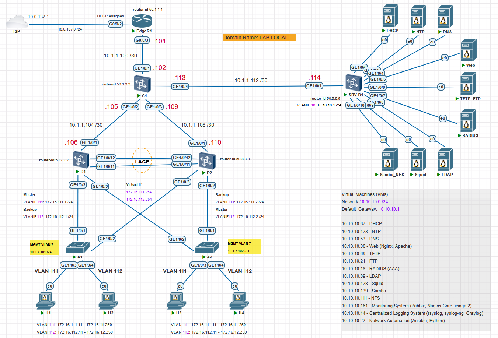

# Huawei-Based Enterprise Network Design and Implementation / Huawei құрылғылары негізінде корпоративті желіні жобалау және конфигурациялау

## Scenario
1) Configure VLAN (Create VLANs and Access Port, Trunk Port)  
   LACP Link Aggregation. Eth-Trunk  
   MSTP (Multiple Spanning Tree Protocol)  
2) VRRP (Virtual Router Redundancy Protocol)
3) Single-Area OSPF
4) DHCP
5) NAT (Easy IP)
6) Remote Access (SSH, Telnet)
7) NTP
8) DNS
9) HTTP
10) FTP
11) TFTP
12) ...

### Корпоративті желінің топологиясы

[Download Link for PNETLab Topology File](Topology/Topology_EnterpriseNetworkDesign_HQ1_v1_Huawei.zip)

### A1, A2 – Access Layer Switch-ті конфигурациялау
```shell
Password: Huawei@123

<Huawei> undo terminal monitor
<Huawei> system-view
[Huawei] sysname A1
[A1] 

[A1] vlan batch 111 112
[A1] display vlan

[A1] port-group group-member g1/0/1 g1/0/2
[A1] port link-type trunk
[A1] port trunk allow-pass vlan 111 112

[A1] display port vlan

[A1] stp region-configuration
[A1] region-name LAN1
[A1] instance 1 vlan 111
[A1] instance 2 vlan 112
[A1] check region-configuration

[A1] quit

[A1] display stp instance 1 brief
[A1] display stp instance 2 brief

[A2] display stp instance 1 brief
[A2] display stp instance 2 brief

[A1] interface g1/0/3
[A1] port link-type access
[A1] port default vlan 111

[A1] interface g1/0/4
[A1] port link-type access
[A1] port default vlan 112

[A1] display vlan
```

### D1, D2 – Distribution Layer Switch-ті конфигурациялау
```shell
Please configure the login password (8-16)
Enter Password: Huawei@123
Confirm Password: Huawei@123

<Huawei> undo terminal monitor
<Huawei> system-view
[Huawei] sysname D1
[D1]

[D1] vlan batch 111 112
[D1] display vlan

[D1] interface Eth-Trunk 1
[D1] port link-type trunk
[D1] port trunk allow-pass vlan 111 112
[D1] mode lacp

[D1] display port vlan

[D1] int g1/0/11
[D1] eth-trunk 1
[D1] display this

[D1] int g1/0/12
[D1] eth-trunk 1
[D1] display this

[D1] display int brief

[D2] display eth-trunk 1
[D2] display int eth-trunk 1

[D1] port-group group-member g1/0/2 g1/0/3
[D1] port link-type trunk
[D1] port trunk allow-pass vlan 111 112

[D1] display port vlan

[D1] display stp
[D1] stp enable
[D1] stp mode mstp

[D1] stp region-configuration
[D1] region-name LAN1
[D1] instance 1 vlan 111
[D1] instance 2 vlan 112
[D1] active region-configuration
[D1] check region-configuration

[D1] quit

---------------------
ҚОСЫМША АҚПАРАТ!

revision-level 1
stp global enable
---------------------

[D1] stp instance 1 root primary
[D1] stp instance 2 root secondary

[D2] stp instance 2 root primary
[D2] stp instance 1 root secondary
```

```shell
Please configure the login password (8-16)
Enter Password: Huawei@123
Confirm Password: Huawei@123

<Huawei> undo terminal monitor
<Huawei> system-view
[Huawei] sysname D2
[D2]
```

### C1 – Core Layer Switch-ті конфигурациялау
```shell
<Huawei> undo terminal monitor
<Huawei> system-view
[Huawei] sysname C1
```

### SRV-D1 – Distribution Layer Switch-ті конфигурациялау
```shell
<Huawei> undo terminal monitor
<Huawei> system-view
[Huawei] sysname SRV-D1
```

### EdgeR1 – Edge Router-ді конфигурациялау
```shell
<Huawei> undo terminal monitor
<Huawei> system-view
[Huawei] sysname EdgeR1
```
